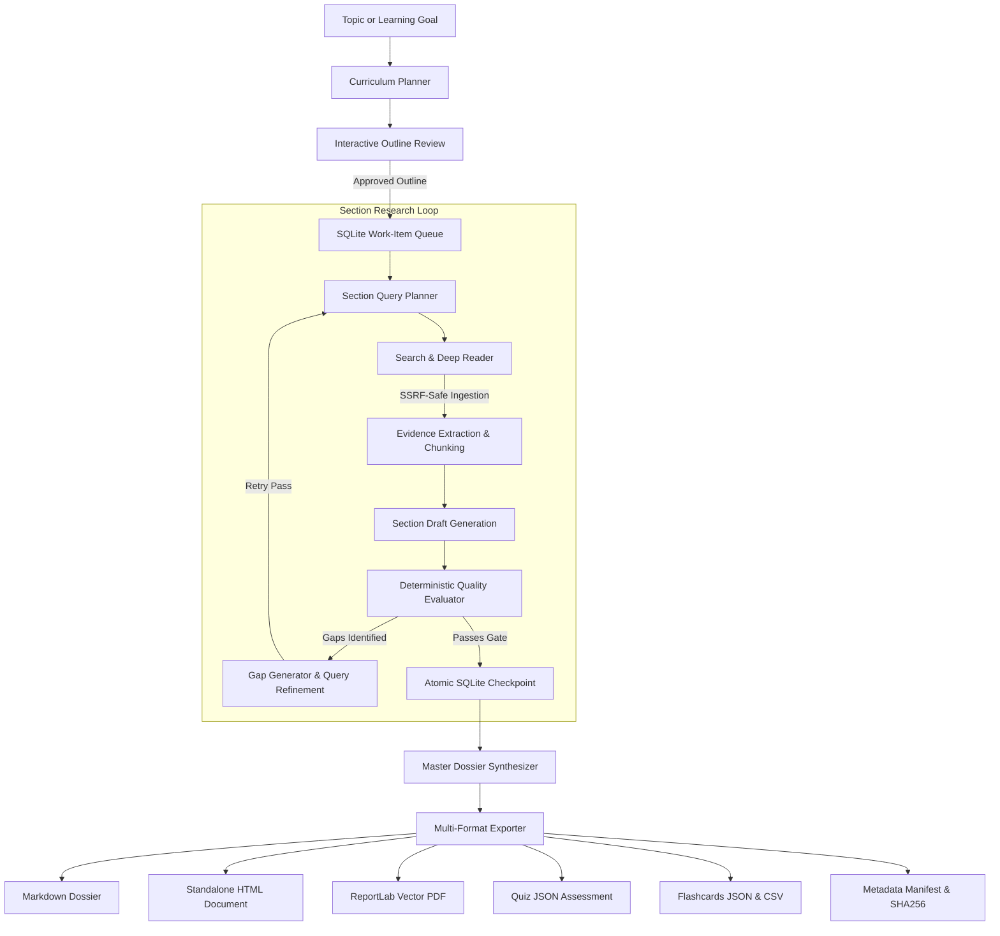

# Kythe: Agentic Deep Research and Curriculum Engine

Kythe decomposes technical topics into structured curriculum sections, gathers web evidence using a protected deep reader, evaluates section drafts against deterministic quality gates, and exports learning dossiers in multiple formats.

---

## System Architecture

Kythe manages research through an eight-stage execution lifecycle:



### Key Subsystems

- **Section Work-Item Queue**: The planner breaks complex subjects into discrete modules with explicit learning objectives and target depths (`basic`, `intermediate`, or `advanced`).
- **Protected Deep Reader**: Web pages and documentation are fetched with DNS pinning, private and loopback IP blocking, streaming size caps, and content-hash caching in SQLite.
- **Deterministic Quality Gates**: The evaluator scores drafts on target word counts, source diversity across unique domains, code examples, citation density (`<cite source="src-id"/>`), and style hygiene.
- **Transactional SQLite Storage**: SQLite in WAL mode with compare-and-swap transitions guarantees state recovery. Paused or interrupted runs resume from the last unfinished pass without re-fetching cached evidence.
- **Interactive Outline Editor**: Users can modify section titles, objectives, ordering, and depth targets prior to automated execution.
- **Multi-Format Exporters**: Completed research outputs Markdown files, responsive HTML documents with print styling, vector PDFs with running headers, Anki flashcards, multiple-choice quiz JSON, and SHA256 checksum manifests.

---

## Installation & Setup

### 1. Clone Repository and Install Dependencies

```bash
git clone https://github.com/Cedsbstn/Learning-assistant-adk.git
cd learning_agent
pip install -r requirements.txt
```

### 2. Configure Environment

Copy the example environment file and add your Google AI Studio API key:

```bash
cp .env.example .env
```

```ini
GOOGLE_API_KEY=your_google_api_key_here
```

---

## CLI Usage

### Start a Research Run

```bash
# Interactive outline review with the standard preset
python main.py research "Distributed Consensus Algorithms and Raft"

# Run with the deep preset and bypass interactive outline review
python main.py research "Zero Knowledge Proofs and zk-SNARKs" --preset deep --auto-approve

# Run in headless mode without the live terminal dashboard
python main.py research "Raft Consensus" --preset quick --auto-approve --no-dashboard

# Specify custom export formats
python main.py research "Rust Memory Safety and Concurrency" --formats markdown,html,pdf,quiz,flashcards
```

### Resume an Interrupted Run

```bash
python main.py resume run_4f89a1c2
```

### Inspect Run Status

```bash
python main.py status run_4f89a1c2
```

### List Runs

```bash
python main.py list-runs
python main.py list-runs --status completed
```

### Re-Export Artifacts

```bash
python main.py export run_4f89a1c2 --formats pdf,html,flashcards
```

---

## Quality Presets

| Preset | Target Words / Section | Min Sources | Min Domains | Min Citation Coverage | Max Passes | Style Filter |
| :--- | :--- | :--- | :--- | :--- | :--- | :--- |
| `quick` | 150 | 2 | 1 | 40% | 2 | Enabled |
| `standard` | 250 | 3 | 2 | 60% | 3 | Enabled |
| `deep` | 400 | 4 | 3 | 70% | 4 | Enabled |
| `comprehensive` | 500 | 5 | 3 | 80% | 5 | Enabled |

---

## Generated Artifacts

Completed runs store generated assets in the `output/` directory:

- `curriculum_<run_id>.md`: Consolidated Markdown dossier with executive summary and source bibliography.
- `curriculum_<run_id>.html`: Self-contained HTML file with dark mode support, keyboard navigation, and print stylesheets.
- `curriculum_<run_id>.pdf`: Vector PDF generated with ReportLab.
- `quiz_<run_id>.json`: Multiple-choice questions with answer explanations and source mappings.
- `flashcards_<run_id>.json` & `flashcards_<run_id>.csv`: Spaced-repetition cards for Anki.
- `metadata_<run_id>.json`: Execution audit log with section scores, token metrics, and SHA256 file checksums.

---

## Testing

Execute the test suite with pytest:

```bash
pytest -v
```

---

## License

Apache License 2.0. Copyright 2026 Cedric Sebastian.
