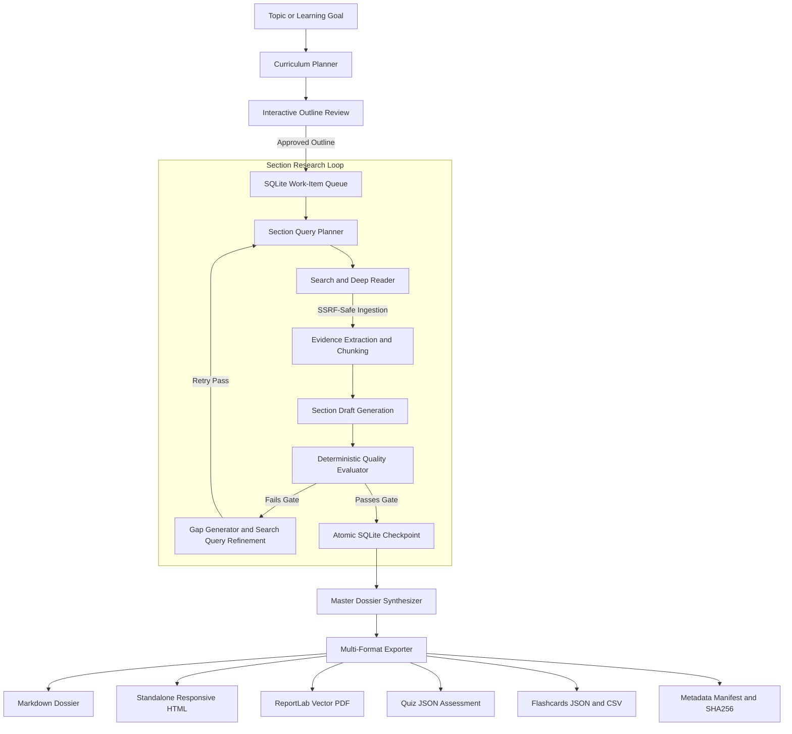

# Kythe: Autonomous Deep Research and Curriculum Learning Agent

Kythe is an autonomous research engine built with the Google Agent Development Kit (ADK) and Gemini 2.5/3. It decomposes broad technical topics into discrete section work items, iteratively acquires primary web evidence through SSRF-protected ingestion, executes deterministic multi-gate quality evaluation, and generates verifiable learning dossiers across multiple export formats.

---

## Architecture Overview

Kythe executes research through an eight-stage modular lifecycle:



### Core Architecture Components

1. **Section Work-Item Model**: Topics are decomposed into discrete, ordered sections with explicit learning objectives and depth targets (`basic`, `intermediate`, `advanced`).
2. **SSRF-Protected Deep Reader**: Fetches and parses full-page HTML and PDF documents safely with DNS pinning, private/loopback IP filtering, streaming size caps, and content-hash caching.
3. **Deterministic Quality Gates**: Multi-gate evaluation checks word count, section-scoped evidence count, domain diversity, code block presence, citation coverage (`<cite source="src-id"/>`), and antislop compliance (banned buzzwords and forbidden punctuation).
4. **Resilient SQLite Persistence**: ACID checkpointing in WAL mode ensures zero state loss on network interruption or crash. Research resumes from the exact last incomplete pass.
5. **Interactive Outline Review**: Review, edit, add, remove, reorder, or adjust depth targets for curriculum sections before launching autonomous research.
6. **Multi-Format Learning Exporters**: Generates Markdown dossiers, responsive HTML documents with sticky navigation and print stylesheets, ReportLab PDFs, Quiz JSON assessments, Anki-compatible Flashcards (JSON and CSV), and cryptographic SHA256 metadata manifests.

---

## Quick Start

### Installation

```bash
# Clone the repository
git clone https://github.com/Cedsbstn/Learning-assistant-adk.git
cd learning_agent

# Install dependencies
pip install -r requirements.txt
```

### Environment Setup

Copy `.env.example` to `.env` and set your API keys:

```bash
cp .env.example .env
```

```ini
GEMINI_API_KEY=your_gemini_api_key_here
SEARCH_API_KEY=your_google_search_api_key_here  # Optional: defaults to gemini built-in search
```

---

## CLI Usage and Subcommands

### 1. Start a New Autonomous Research Run

```bash
# Interactive outline review with standard preset
python main.py research "Distributed Consensus Algorithms and Raft"

# Run with deep preset and headless auto-approval
python main.py research "Zero Knowledge Proofs and zk-SNARKs" --preset deep --auto-approve

# Specify custom export formats
python main.py research "Rust Memory Safety and Concurrency" --formats markdown,html,pdf,quiz,flashcards
```

### 2. Resume an Interrupted or Paused Run

```bash
python main.py resume run_4f89a1c2
```

### 3. Check Real-Time Run Status and Metrics

```bash
python main.py status run_4f89a1c2
```

### 4. List All Research Runs

```bash
python main.py list-runs
python main.py list-runs --status completed
```

### 5. Re-Export Artifacts

```bash
python main.py export run_4f89a1c2 --format pdf,html,flashcards
```

---

## Quality Presets

| Preset | Min Words / Sec | Min Sources | Min Domains | Min Citation Coverage | Max Passes | Antislop Gate |
| :--- | :--- | :--- | :--- | :--- | :--- | :--- |
| **`quick`** | 150 | 2 | 1 | 40% | 2 | Enabled |
| **`standard`** | 250 | 3 | 2 | 60% | 3 | Enabled |
| **`deep`** | 400 | 4 | 3 | 70% | 4 | Enabled |
| **`comprehensive`**| 500 | 5 | 3 | 80% | 5 | Enabled |

---

## Output Artifacts

Every completed research run writes generated assets to `output/`:

- `curriculum_<run_id>.md`: Full consolidated markdown research dossier with executive summary and citation index.
- `curriculum_<run_id>.html`: Standalone HTML document with syntax highlighting, sticky navigation, and print stylesheets.
- `curriculum_<run_id>.pdf`: Vector PDF generated via ReportLab with running headers, page numbers, and custom typography.
- `quiz_<run_id>.json`: Structured multiple-choice questions with answer keys, explanations, and source links.
- `flashcards_<run_id>.json` & `flashcards_<run_id>.csv`: Spaced-repetition flashcards compatible with Anki.
- `metadata_<run_id>.json`: Execution manifest with deterministic quality scores, section runtimes, and SHA256 checksums.

---

## Testing

Run the test suite with pytest:

```bash
pytest -v
```

---

## License

Apache License 2.0. Copyright 2026 Cedric Sebastian.
